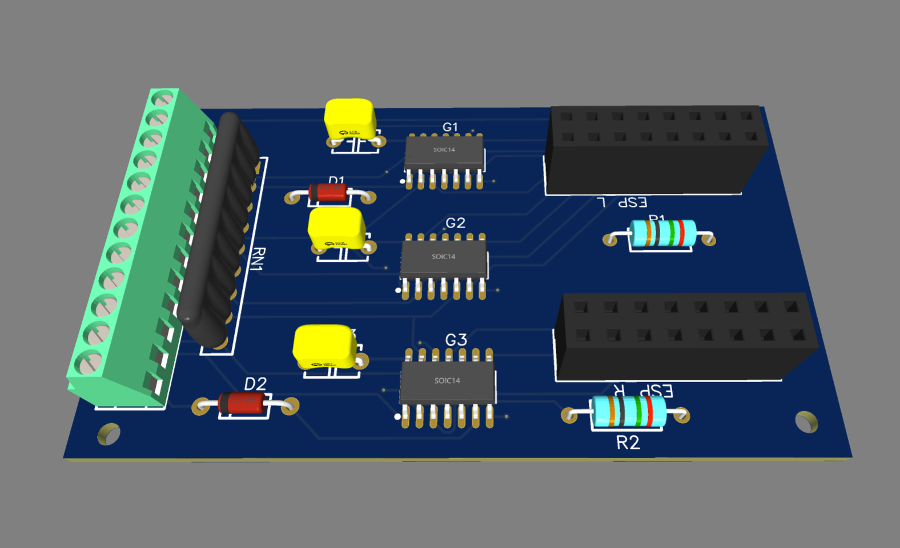
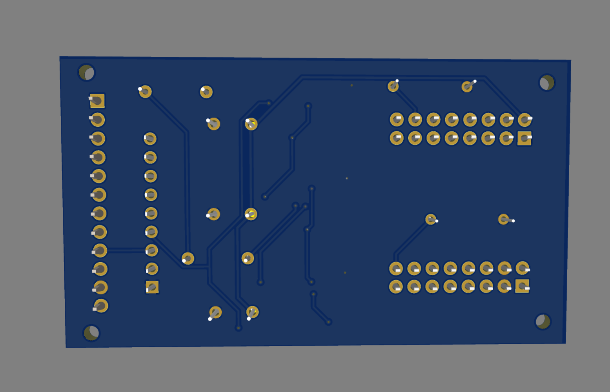

# Hardware

## PCB

Render:

| Top View                     | Bottom View                        |
| ---------------------------- | ---------------------------------- |
|  |  |

## Bill Of Materials

<!-- Made with https://tableconvert.com/markdown-generator -->
| **Name**             | **Designator** | **Footprint**         | **Manufacturer**   | **Manufacturer Part** | **Shop Link**                                                                           | **Spec Link**                                                                                      |
| -------------------- | -------------- | --------------------- | ------------------ | --------------------- | --------------------------------------------------------------------------------------- | -------------------------------------------------------------------------------------------------- |
| AND Gate             | G1,G2,G3       | SOP-14 [1] | Toshiba            | TC74HC08AF(F)         | [RS-Online](https://jp.rs-online.com/web/p/logic-gates/5407620)                         | [RS-Online](https://docs.rs-online.com/1187/0900766b8082eec6.pdf)                                  |
| Capacitor            | C1,C2,C3       | Through hole          | Kemet              | C322C104K5R5TA        | [RS-Online](https://jp.rs-online.com/web/p/mlccs-multilayer-ceramic-capacitors/5381433) | [RS-Online](https://docs.rs-online.com/d8bc/0900766b81708365.pdf)                                  |
| Shottky Diode        | D1,D2          | DO-35                 | STMicroelectronics | BAT41                 | [RS-Online](https://jp.rs-online.com/web/p/schottky-diodes-rectifiers/5444679)          | [RS-Online](https://docs.rs-online.com/c98b/0900766b807760f3.pdf)                                  |
| 10kΩ Resistor        | R1,R2          | 2.7x6.2mm (MRS25?)    | ???                | ???                   | [Aliexpress](https://www.aliexpress.com/item/1005003117726705.html)                     | -                                                                                                  |
| 2x8pin Socket        | ESP_L, ESP_R   | Through hole, 2.54mm  | HARWIN             | M20-7830846           | [RS-Online](https://jp.rs-online.com/web/p/pcb-sockets/6816848)                         | [RS-Online](https://docs.rs-online.com/261c/0900766b8154d27c.pdf)                                  |
| 10kΩ Resistor Array  | RN1            | Through hole, 2.54mm  | KOA or clone       | 103J                  | [Eleshop](https://eleshop.jp/shop/g/g71G13K/)                                           | [KOA](https://www.koaglobal.com/-/media/Files/KOA_Global/EN/product/common/eol/rkl_eol.pdf)        |
| 12Pin Screw Terminal | U1             | Through hole, 2.54mm  | ???                | ???                   | [Amazon](https://www.amazon.co.jp/gp/product/B07YBXQXXT)                                | Probably [LCSC](https://datasheet.lcsc.com/lcsc/2301061530_DORABO-DB125-2-54-12P-GN-S_C918129.pdf) |
| ESP32-S2 Dev Board   | -              | -                     | Wemos              | S2 mini               | [Aliexpress](https://www.aliexpress.com/item/1005003145192016.html)                     | [Wemos](https://www.wemos.cc/en/latest/s2/s2_mini.html)                                            |

[1]: The gate is in SOP-14 package, but there's a mistake on the PCB and the gate there is in SOIC-14 package. I was able to solder the gate onto SOIC-14, but that should be avoided in the future
